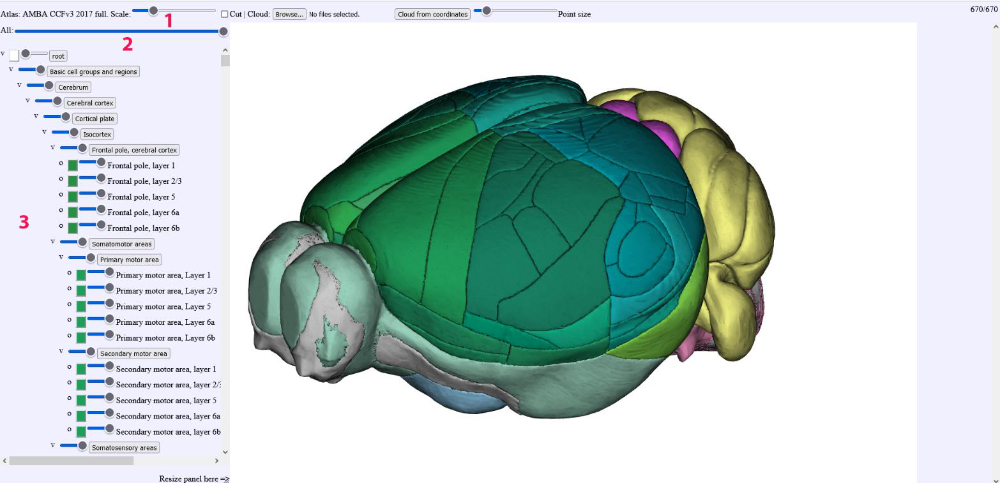
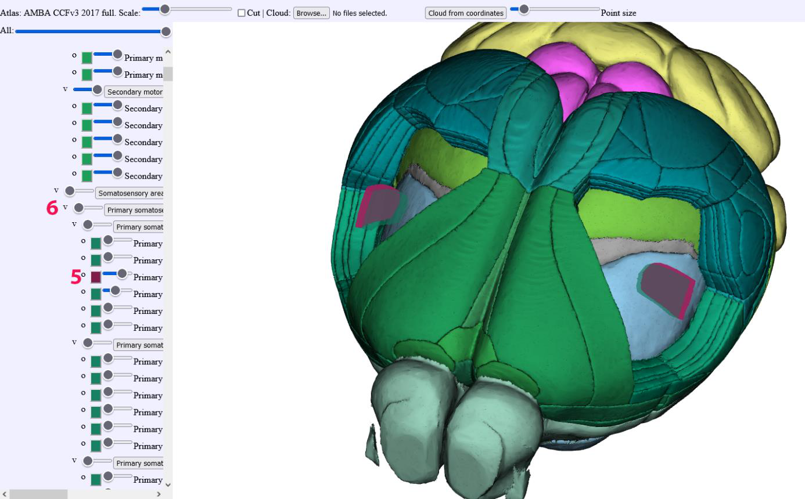

**Basic usage description**
------------------------------

   
(1)  Allows scaling of the brain   
(2)  Global control of all structures, using the slider will render
     the meshes transparent or disappear   
(3)  Individual control: each structure can be made transparent or
     disappear  
   
.. image:: 483026fbdc47496f8b140360f8bcbb0c/media/image2.png
   :width: 6.29861in
   :height: 3.78194in   
   
(4)  Individual control: the color for each structure can be changed
     when clicking on the colored square
(5)  The color control panel: allow users to define their own colors   
(6)  Navigation in the hierarchy is possible by clicking on the region  
     names (grey boxes), this will collapse parts of the region tree.
  

The controls are identical for the Rat version of MeshView

.. image:: 483026fbdc47496f8b140360f8bcbb0c/media/image16.png
   :width: 6.30139in
   :height: 3.90833in
