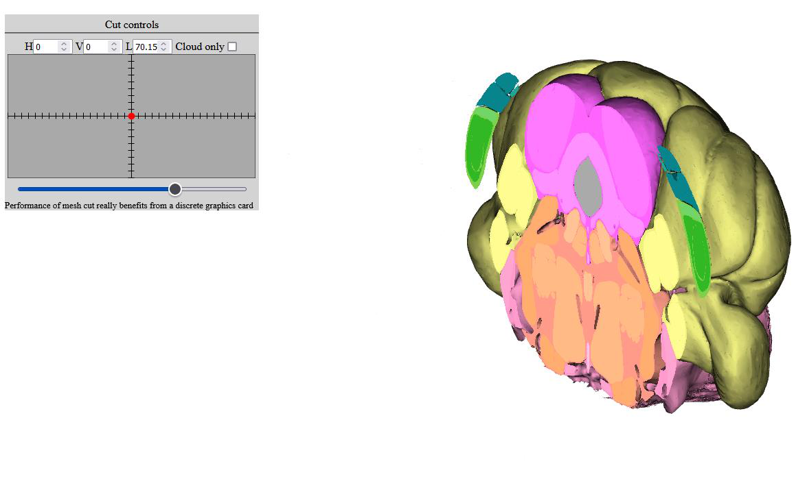
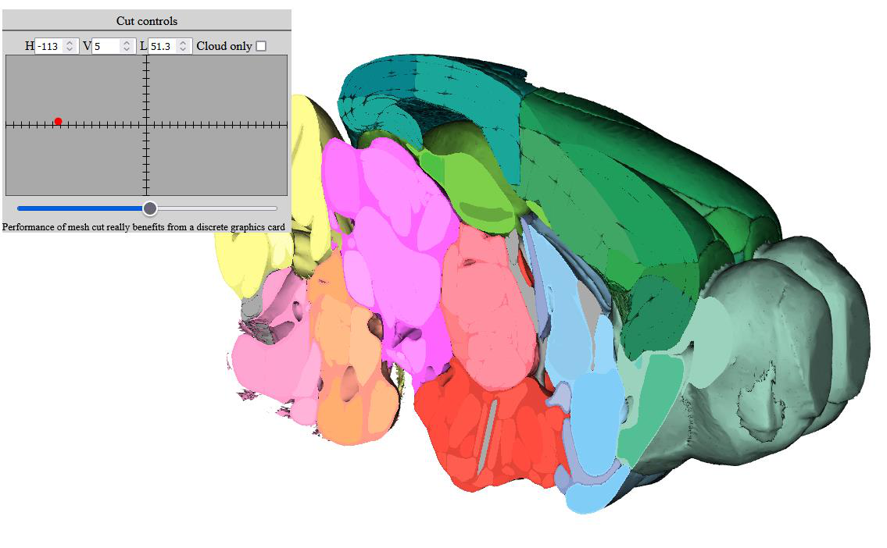
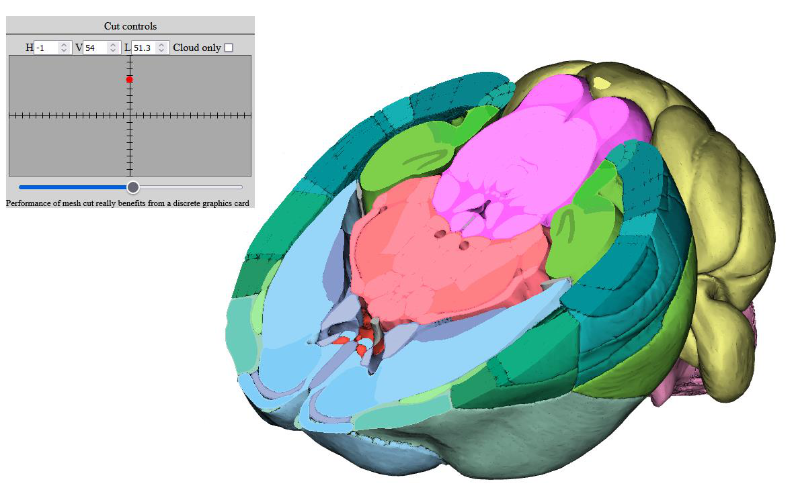
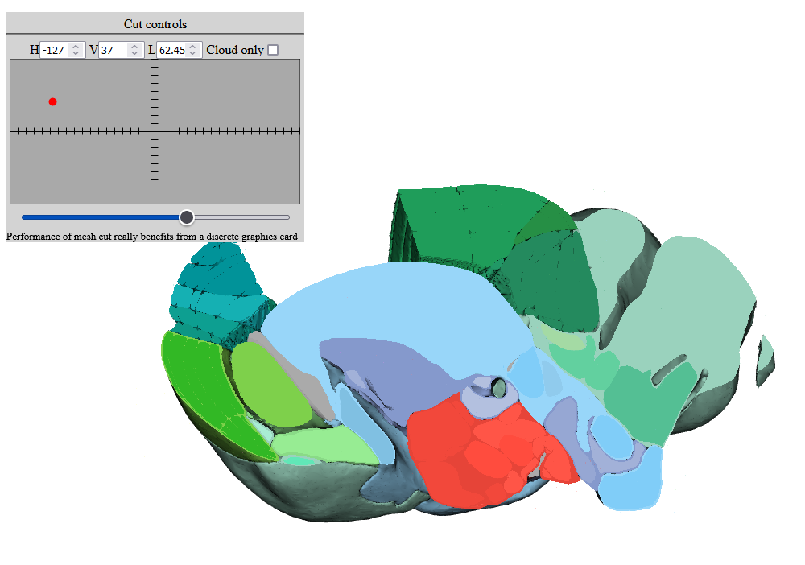

**Cut controls**
-------------------
The brain meshes will be cut when they are fully-opaque but will disappear if set to semi-transparent. Point clouds can also be cut when present by selecting the "Cloud only" button (see more details in the Point cloud section).

.. image:: 483026fbdc47496f8b140360f8bcbb0c/media/image4.png
   :width: 6.30139in
   :height: 3.77778in
   
(7) Cut toggle: Enables/disables cutting the volume. The cut control
    window will appear.
(8) Cut control window: the red dot shows the cut
    plane orientation. Plane orientation runs from -180 to 180 degrees
    horizontally and -90 to 90 degrees vertically. The 0-0 starting
    orientation describes a Coronal section. Technically, what is
    controlled is the normal vector of the cutplane.   
(9) The blue slider is for moving the cutplane along its normal vector.

*Cut examples*
^^^^^^^^^^^^^^  

