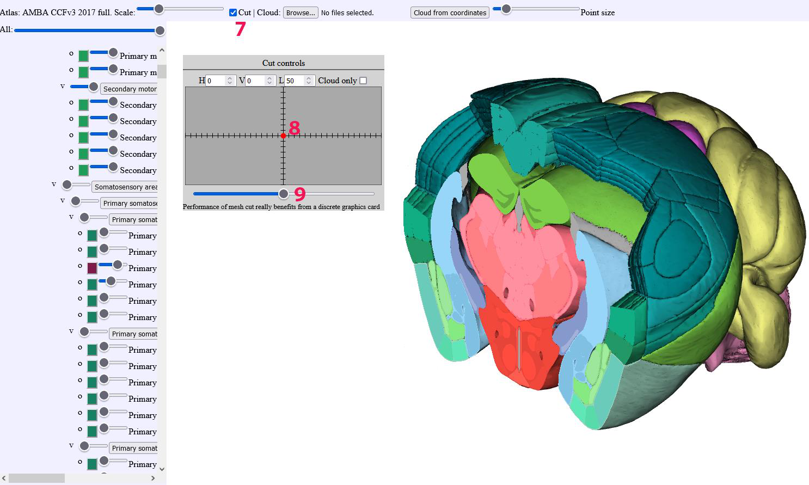

**Cut controls**
-------------------

   
(7) Cut toggle: Enables/disables cutting the volume. The cut control
    window will appear. 8.Cut control window: the red dot shows the cut
    plane orientation. Plane orientation runs from -180 to 180 degrees
    horizontally and -90 to 90 degrees vertically. The 0-0 starting
    orientation describes a Coronal section. Technically, what is
    controlled is the normal vector of the cutplane.   
   
   
 
