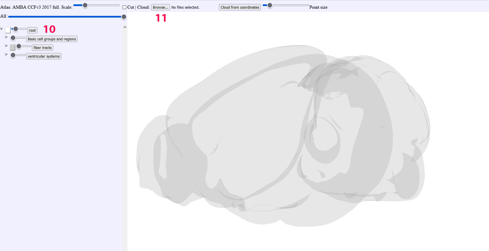
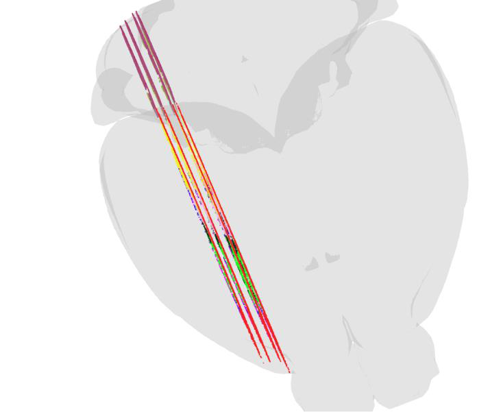
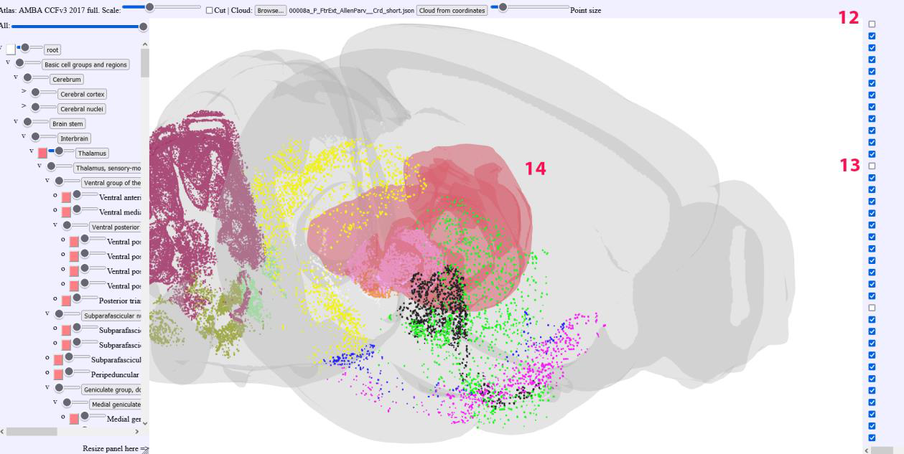
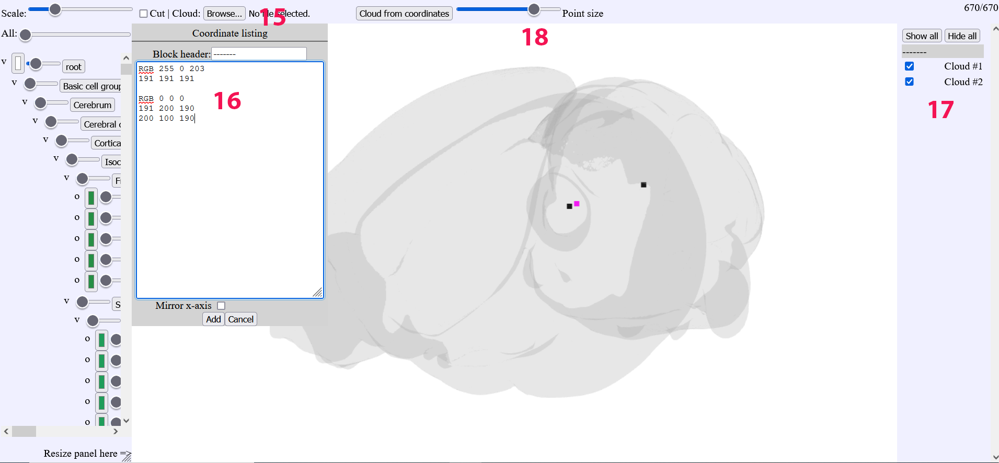
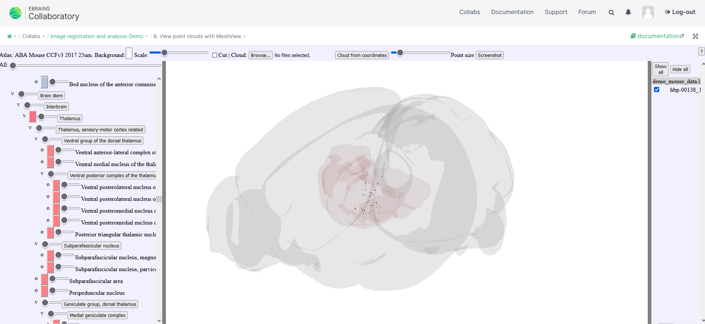
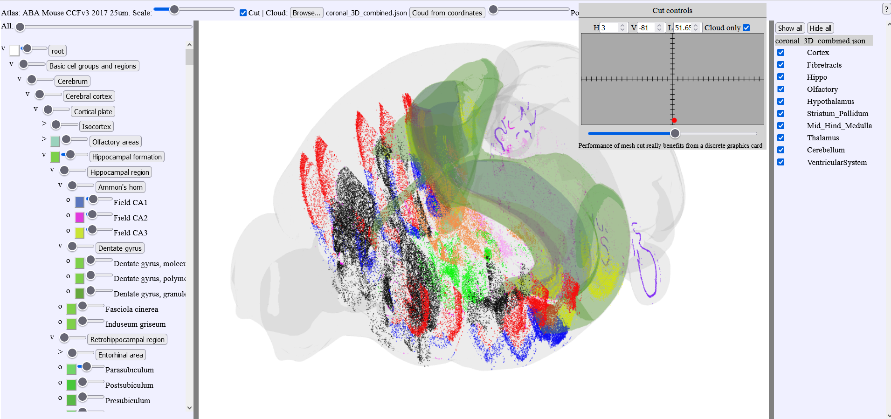

**Displaying point clouds**
------------------------------
Use json file obtained in the QUINT workflow
^^^^^^^^^^^^^^^^^^^^^^^^^^^^^^^^^^^^^^^^^^^^^^

   
   
(10) Start with deselecting all structures and place the “root” slider
     bar so that the envelope shape is transparent
(11) Click on “browse” and import a json file containing your point
     clouds from the QUINT workflow, you can choose the “all” file in
     order to get all points or choose the individual json files for
     individual slices. For importing point cloud files from others
     sources, try to use the json format as adopted for QUINT.
     

.. image:: 483026fbdc47496f8b140360f8bcbb0c/media/image11.png
   :width: 6.3in
   :height: 2.97639in
   
(12) On the left handside, the list of point clouds is displayed.
(13) The point cloud lists can be individually deselected or completely
     hidden
     

   
(14) The brain region Meshes can be individually selected, made
     transparent or completely hidden.
   
Use coordinate upload
^^^^^^^^^^^^^^^^^^^^^^^^^^^^^^^^^^^^^^^^^^^^^^

It is possible to upload coordinates directly as coordinate triplets

(15) The "browse" button will open a new window
(16) Coordinate triplets of points can be pasted in the new window. Color of the points are chosen by appending the RGB color code above the coordinates
(17) The clouds can be toggled
(18) Slider for the point size

Opening LocaliZoom files in the EBRAINS collab
^^^^^^^^^^^^^^^^^^^^^^^^^^^^^^^^^^^^^^^^^^^^^^
MeshView can open annotations from LocaliZoom files saved in the storage Bucket (.lz files) 
The "screenshot" button allows to capture the main window view as a png file.
For more information, see:  https://wiki.ebrains.eu/bin/view/Collabs/image-registration-and-analysis-demo/1.%20Create%20your%20own%20working%20space/

Cutting point clouds
^^^^^^^^^^^^^^^^^^^^^^^^^^^^^^^^^^^^^^^^^^^^^^
Point clouds can be cut when choosing the option "Cloud only" in the cut window.

.. image:: 483026fbdc47496f8b140360f8bcbb0c/media/image17.png
   :width: 6.3in
   :height: 3.16528in
   
   
The atlas meshes can be visualized but will not be cut  

   
MeshView with double cut feature
^^^^^^^^^^^^^^^^^^^^^^^^^^^^^^^^^^^^^^^^^^^^^^
We have created customized versions of MeshView for working in specific brain regions and allowing the 3D point clouds to be cut from two directions. This function was used in the data descriptor paper by Øvsthus et al. 2023 (manuscript). Briefly, multiple point clouds representing the cortico-pontine projections in rat and mouse were generated and used to study the topographical distribution of these connections. By cutting the 3D point clouds in thin slices, the spatial distribution was revealed (see figure)

MeshView double cut mouse atlas links:
----------------------------------------

https://meshview.apps.hbp.eu/?atlas=ABA_mouse_v3_2017_full&mode=pointblock

https://meshview.apps.hbp.eu/?atlas=ABA_mouse_v3_2017_L&mode=pointblock

https://meshview.apps.hbp.eu/?atlas=ABA_mouse_v3_2017_R&mode=pointblock

Caudoputamen:

https://meshview.apps.hbp.eu/?atlas=ABA_mouse_v3_2017_CPuL&mode=pointblock

https://meshview.apps.hbp.eu/?atlas=ABA_mouse_v3_2017_CPuR&mode=pointblock

Hindbrain:

https://meshview.apps.hbp.eu/?atlas=ABA_mouse_v3_2017_hindbrain&mode=pointblock

https://meshview.apps.hbp.eu/?atlas=ABA_mouse_v3_2017_Lh&mode=pointblock

https://meshview.apps.hbp.eu/?atlas=ABA_mouse_v3_2017_Rh&mode=pointblock

Superior colliculus:

https://meshview.apps.hbp.eu/?atlas=ABA_mouse_v3_2017_SCL&mode=pointblock

https://meshview.apps.hbp.eu/?atlas=ABA_mouse_v3_2017_SCR&mode=pointblock

Thalamus:

https://meshview.apps.hbp.eu/?atlas=ABA_mouse_v3_2017_ThalL&mode=pointblock

https://meshview.apps.hbp.eu/?atlas=ABA_mouse_v3_2017_ThalR&mode=pointblock

MeshView double cut rat atlas link:
----------------------------------------

