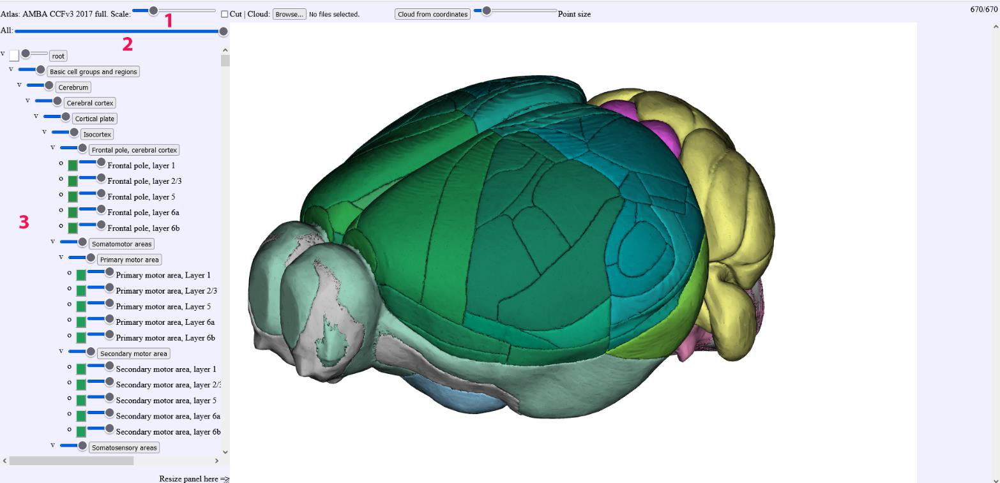

**Saving atlas configuration**
------------------------------

A new feature in MeshView allows you to save the atlas configuration of your choice for reuse or sharing. This feature is available on the MeshView app: https://meshview.apps.ebrains.eu
but not in QUINT-online or LocaliView yet.

