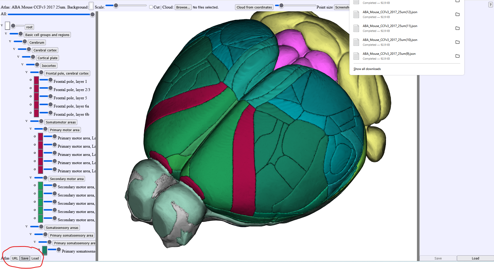

**Saving atlas configuration**
------------------------------

A new feature in MeshView allows you to save the atlas configuration of your choice for reuse or sharing. This feature is available on the MeshView app: https://meshview.apps.ebrains.eu
but not in QUINT-online or LocaliView yet.

In the left bottom corner, the Atlas URL button will save the atlas position (front view, top view, rotation) and the "Save" button will save any changes done to the atlas meshes like color change or transparency level. 
A file will be downloaded. You can upload that file in another browser window using the "Load" button in the left bottom corner.
The combination of the URL and the saved atlas will reproduce your custom orientation and colorisation of the atlas.

